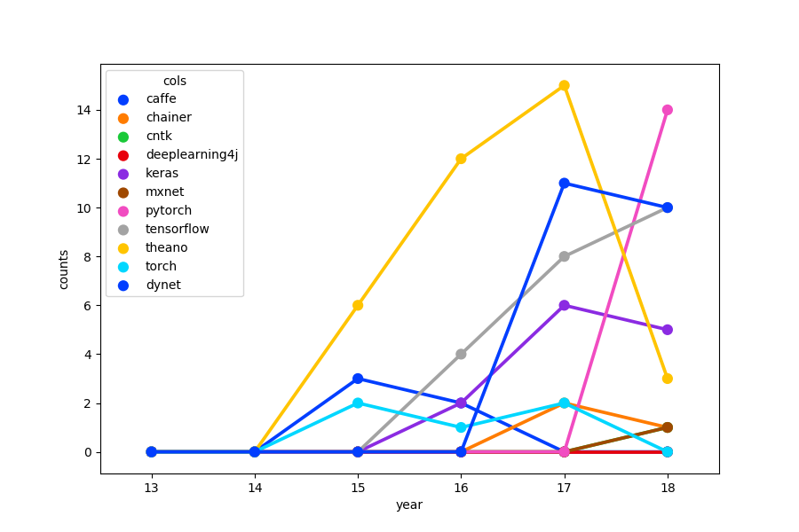

# ACL Investigator

A tool to count how many ACL papers including specific keywords.

## Development Environment

* Python 3.6.0
* requests
* pdfminer.six
* and their dependencies

## How to Run

You should prepare a word list in advance.
An example file `wordlist-dltools.txt` is in the `data` directory.

First, run the following script.
Crawling ACL Anthology, this builds a json file which include the information of word occurrence.
The output for `wordlist-dltools.txt` is also in the `data` directory.

```
$ python src/run_crawler.py data/wordlist-dltools.txt \
--year 16,17,18 \  # the year of conferences
--type ls \  # the type of submission ("l" and "s" indicate long and short paper respectively)
--out data/result-dltools.json  # the output will be given as a json file
--jobs 100  # number of jobs
```

Finally, run the following script to visualize the result.

```
$ python src/run_visualizer.py data/word-list-dltools.txt  data/result-dltools.json \
--output data/pointplot-dltools.png
```

You will get this figure:


See command line help for other options.

## Why don't you use results of Google search?

Because it costs money.

## TODO

- deal with other related conferences such as NAACL, EMNLP, and so on.
